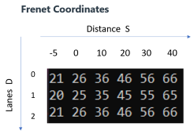

# Writeup

## Project deliverable
- Code must compile without errors with cmake and make.
- Project writeup file

## Project Scope 
The car needs to be able to drive 4.32 mile without incidents, and not exceeding:
- Speed limit
- Max acceleration
- Jerk
- Current lane lines

# IMPORTANT: the car needs to be able to change lanes.

## Highlights of my code

### Grid and Cost

It creates a 3 {0,1,2} by 5 {-5,0,10,20,30,40} grid `(line 33)`, and assign an initial cost to each cell`(line 130)`. The following picture shows the cost for each grid when the vehicle is on the center lane, while not other vehicles are nearby(figure.1). 

figure.1:

### The Initial States
- Initial velocity is 0 mph;
- Initial lane is lane 1;
- The car will change to another lane, when other cars in the same lane are within a 30-meter range.

### Loop Through Each Car `(line 144)`
- loop through the 3 by 5 grid `(line 160)`,
- If there is any car in the grid cell `(line 173)`, then set the cost of the cell to 99;
- If there is a car in the cell and the distance to my own car is less than 30 meter, I will start to reduce my speed`(line 174)`;
- If there is a car in the neighbor lane and parallel to me, I will not change to its lane. Even if there is no other car in front of that one `(line 183)`.

### Find the Minimum Cost`(line 197)`
- If the minimum gird is two lanes away from me, I will not change the lane. Just slow down and follow the traffic`(line 210)`;
- If there is a traffic jam and all cells cost 99, then the car will follow the traffic`(line 223)`;
- Otherwise, change to the lane with the minimum cost grid.

### Cruise Control `(line 234)`
- Maximum speed is 49.5 mph `(line 27)`;
- Use PD controller to control the vehicle speed if there is a car in front of me. The controller is inversely proportional to the distance (S of Frenet system) between me and the other car.
- If there is a change lane command, and the target lane is clear for 2 seconds`(line 28) note: this number may need to be tuned, according to the PC configuration`. Then, my car will change the lane. The delay can avoid going back-forth between two lanes`(line 269)`.

### Trajectory Generation
- It is using a second order spline to generate the trajectory.
- The spline uses five datapoints (using xy Cartesian coordinate system)`(line 312)`
    - Previous locaion
    - Current location
    - Current location + 30
    - Current location + 60
    - Current location + 90
- Calculate the 50 waypoints using the spline`(line 397)`.

### Output `(line 297)`
- Target line
- Target grid distance in S
- Boolean of reducing speed
- timer (iteration) for lane change
- The cost of each cell

### Nest Step
I will try to practice the cost function approach, which is explained in the Behavior planning class. My current code doesn't have cost function for speed, distance, jerk and etc. But before that, I need to review and understand all the code in the quiz in unit 21: Implement Behavior Planner in C++.
To utilize less CPU, I can only consider the care around me, instead of all the cars in the `sensor_fusion` data.

